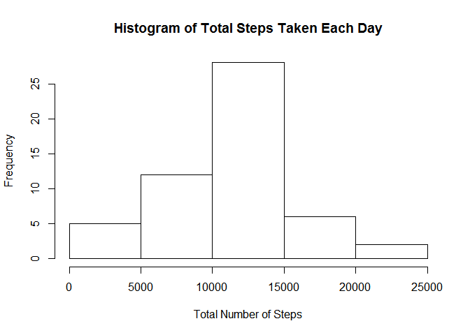
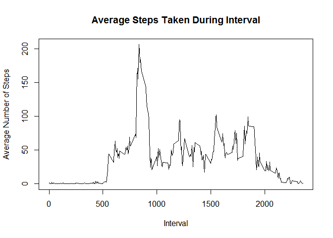
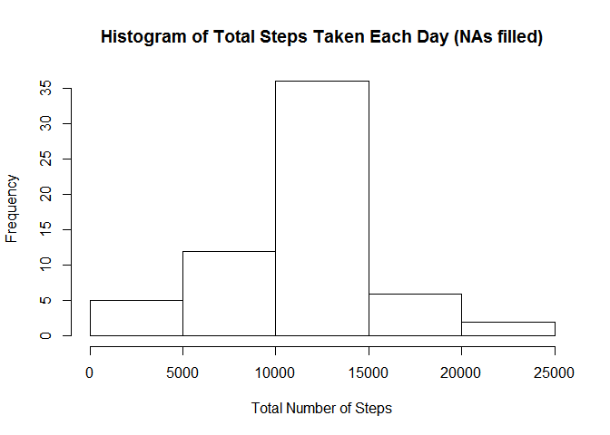
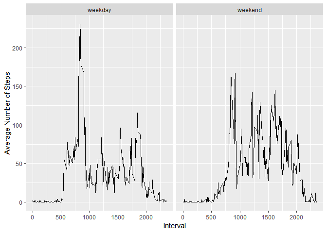

## Loading and preprocessing the data
* First unzip the data file "activity.zip" and then read the csv file into a data frame


```r
unzip(zipfile="activity.zip")
rawdata<-read.csv("activity.csv")
```

## What is mean total number of steps taken per day?
* Install the dplyr package, group the raw data by the date variable and create a summary data frame with the total number of steps taken on each day
* Use base plotting system to plot a histogram of the total number of steps taken each day


```r
library(dplyr)
```

```
## 
## Attaching package: 'dplyr'
```

```
## The following objects are masked from 'package:stats':
## 
##     filter, lag
```

```
## The following objects are masked from 'package:base':
## 
##     intersect, setdiff, setequal, union
```

```r
days<-group_by(rawdata, date)
daysSummary<-summarize(days, totalSteps=sum(steps))
hist(daysSummary$totalSteps, main="Histogram of Total Steps Taken Each Day", xlab="Total Number of Steps")
```

<!-- -->

* **The *mean* total number of steps taken per day is:**


```r
mean(daysSummary$totalSteps, na.rm = TRUE)
```

```
## [1] 10766.19
```

* **The *median* total number of steps taken per day is:**


```r
median(daysSummary$totalSteps, na.rm = TRUE)
```

```
## [1] 10765
```

## What is the average daily activity pattern?
* Group the raw data by the interval variable and create a summary data frame with the average number of steps taken during each interval across all days
* Plot the average number of steps taken during each interval using the base plotting system


```r
intervals<-group_by(rawdata, interval)
intervalsSummary<-summarize(intervals, avgSteps=mean(steps, na.rm = TRUE))
plot(intervalsSummary$interval, intervalsSummary$avgSteps, type = "l", main="Average Steps Taken During Interval", xlab="Interval", ylab="Average Number of Steps")
```

<!-- -->

* Arrange data frame in descending order based on average number of steps and subset the interval from the first row to calculate the 5-minute interval on average across all the days in the data set that contains the maximum number of steps 
* **The 5-minute interval that contains the maximum number of steps is:**


```r
max<-as.data.frame(arrange(intervalsSummary, desc(avgSteps)))
max[1,1]
```

```
## [1] 835
```

## Imputing missing values
* Calculate the total number of missing values (i.e. the total number of rows with NAs) in the data set by subtracting the number of complete rows (i.e. containing no NAs) in the data frame from the total number of rows
* **Number of missing values is:**


```r
nrow(rawdata)-sum(complete.cases(rawdata))
```

```
## [1] 2304
```

* Fill in all of the NAs in the data set by substituting in the average number of steps previously calculated for that specific 5-minute interval
* Create a for loop that inspects each row for NAs in the "steps" column. If an NA is present, take note of the interval, then retrieve the average number of steps associated with that interval from the previously constructed data frame. Insert this value into a copy of the original data frame to replace the missing value.


```r
newrawdata<-rawdata
for(i in 1:nrow(rawdata)) {
        if(is.na(rawdata[i,"steps"])) {
                int<-rawdata[i,"interval"]
                newrawdata[i,"steps"]<-filter(intervalsSummary, interval==int)[1,"avgSteps"]
        }
}
```

* Use base plotting system to plot a histogram of the total number of steps taken each day with the missing values filled in


```r
newdays<-group_by(newrawdata, date)
newdaysSummary<-summarize(newdays, totalSteps=sum(steps))
hist(newdaysSummary$totalSteps, main="Histogram of Total Steps Taken Each Day (NAs filled)", xlab="Total Number of Steps")
```

<!-- -->

* **The new *mean* total number of steps taken per day is:**


```r
mean(newdaysSummary$totalSteps)
```

```
## [1] 10766.19
```

* **The new *median* total number of steps taken per day is:**


```r
median(newdaysSummary$totalSteps)
```

```
## [1] 10766.19
```

* **With missing data filled in the *mean* is the same as it is with the missing data**
* **With missing data filled in the *median* is larger than it is with the missing data**

## Are there differences in activity patterns between weekdays and weekends?
* Convert dates from 'character' to 'Date' class and add a new column to data frame indicating the day of the week for each date
* Use ifelse function to determine if each day of the week is a 'weekday' or 'weekend' and add this two-level factor variable to the data frame as a new column
* Group the data by the interval and weekday/weekend factor variable and create a summary data frame with the average number of steps taken during each interval during the weekday days and weekend days
* Create a panel plot using ggplot2 showing the average number of steps taken during each interval on weekday days and weekend days


```r
newrawdata$date<-as.Date(newrawdata$date)
newrawdata<-mutate(newrawdata, dayofweek=weekdays(newrawdata$date))
newrawdata<-mutate(newrawdata, typeofday= 
                           ifelse(newrawdata$dayofweek=="Saturday"|
                                          newrawdata$dayofweek==
                                          "Sunday", "weekend", "weekday"))
newrawdata$typeofday<-as.factor(newrawdata$typeofday)

daytypes<-group_by(newrawdata, interval, typeofday)
daytypesSummary<-summarize(daytypes, avgSteps=mean(steps))

library(ggplot2)
g<-ggplot(daytypesSummary, aes(interval, avgSteps))
g+geom_line() + facet_grid(.~typeofday) + labs(x="Interval", y="Average Number of Steps")
```

<!-- -->
